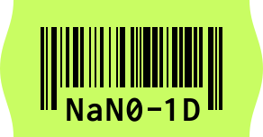

# Nano ID for Kotlin

<a href="https://github.com/viascom/nanoid-kotlin/releases"></a>


<a href="http://www.apache.org/licenses/"></a>

_Inspired by the following parent project: [ai/nanoid](https://github.com/ai/nanoid)_



A tiny, secure, URL-friendly, unique string ID generator for Kotlin.

> “An amazing level of senseless perfectionism, which is simply impossible not to respect.”

* **Small.** Just a simple Kotlin class.
* **Safe.** It uses SecureRandom random generator.
* **Short IDs.** It uses a larger alphabet than UUID (`A-Za-z0-9_-`). So ID size was reduced from 36 to 21 symbols.
* **Portable**. Nano ID was ported
  to [over 20 programming languages](https://github.com/ai/nanoid/blob/main/README.md#other-programming-languages).

## How to use

Add nanoid-kotlin as a dependency to your project.

Gradle:

```gradle
dependencies {
  implementation 'io.viascom.nanoid:nanoid:1.1.0'
}
```

Maven:

```xml

<dependency>
    <groupId>io.viascom.nanoid</groupId>
    <artifactId>nanoid</artifactId>
    <version>1.0.1</version>
</dependency>
```

Start using it:

```kotlin
val id = NanoId.generate()
```

```kotlin
val idWithCustomLength = NanoId.generate(10)
val idWithCustomAlphabet = NanoId.generate(alphabet = "ABC123")
```

## Calculating the additional bytes factor for a custom alphabet

If you change the alphabet of the `NanoId.generate()` function, you could optimize the performance by calculating a new
additional bytes factor with the following function:

```kotlin
val bytesFactor = NanoId.calculateAdditionalBytesFactor("ABC123")
val id = NanoId.generate(21, "ABC123", bytesFactor)
```

Utilizing a custom-calculated additional bytes factor in `NanoId.generate()` enhances string generation performance.
This factor determines how many bytes are generated in a single batch, optimizing computational efficiency. Generating an optimal
number of bytes per batch minimizes redundant operations and conserves memory.

## Usage Guide: `NanoId.generateOptimized()`

The `NanoId.generateOptimized()` function is an advanced version of the `NanoId.generate()` function designed for higher
performance and lower memory overhead. While it provides a more efficient mechanism to generate unique identifiers, it assumes that you
know precisely how you want to use it.

🚫 **Warning**: No checks are performed inside `NanoId.generateOptimized()`. Use it only if you're sure about the
parameters you're passing.

### Example Usage

Generate a NanoId String of length 10 using the default alphabet set:

```kotlin
val id = NanoId.generateOptimized(10, "_-0123456789abcdefghijklmnopqrstuvwxyzABCDEFGHIJKLMNOPQRSTUVWXYZ", 63, 16)
```

### Tips:

- **Performance**: This function is optimized for performance, so it's ideal for scenarios where high-speed ID
  generation is needed.
- **Alphabet Set**: The larger your alphabet set, the more unique your generated IDs will be, but also consider the mask
  and step parameters' adjustments.
- **Customization**: Feel free to adjust the parameters to suit your specific needs, but always be cautious about the
  values you're inputting.

By following this guide, you can seamlessly integrate the `NanoId.generateOptimized()` function into your projects and
enjoy the benefits of its optimized performance.

## 🌱 Contributors Welcome

- 🐛 **Encountered a Bug?** Let us know with an issue. Every bit of feedback helps enhance the project.

- 💡 **Interested in Contributing Code?** Simply fork and submit a pull request. Every contribution, no matter its size,
  is valued.

- 📣 **Have Some Ideas?** We're always open to suggestions. Initiate an issue for discussions or to share your insights.

All relevant details about the project can be found in this README.

Your active participation 🤝 is a cornerstone of **nanoid-kotlin**. Thank you for joining us on this journey.

## 🖥️ Authors

* **Patrick Bösch** - *Initial work* - [itsmefox](https://github.com/itsmefox)
* **Nikola Stanković** - *Initial work* - [nik-sta](https://github.com/nik-sta)

See also the list of [contributors](https://github.com/viascom/nanoid-kotlin/contributors) who participated in this
project. 💕

## License

This project is licensed under the Apache License 2.0 - see the [LICENSE](LICENSE) file for details.
